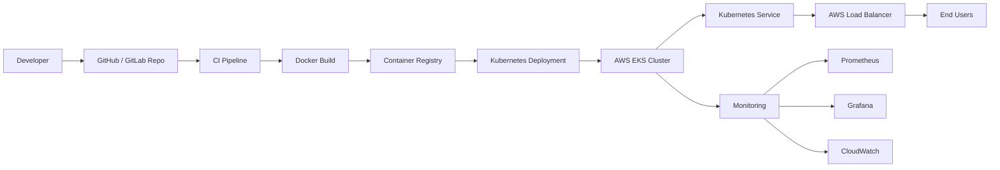
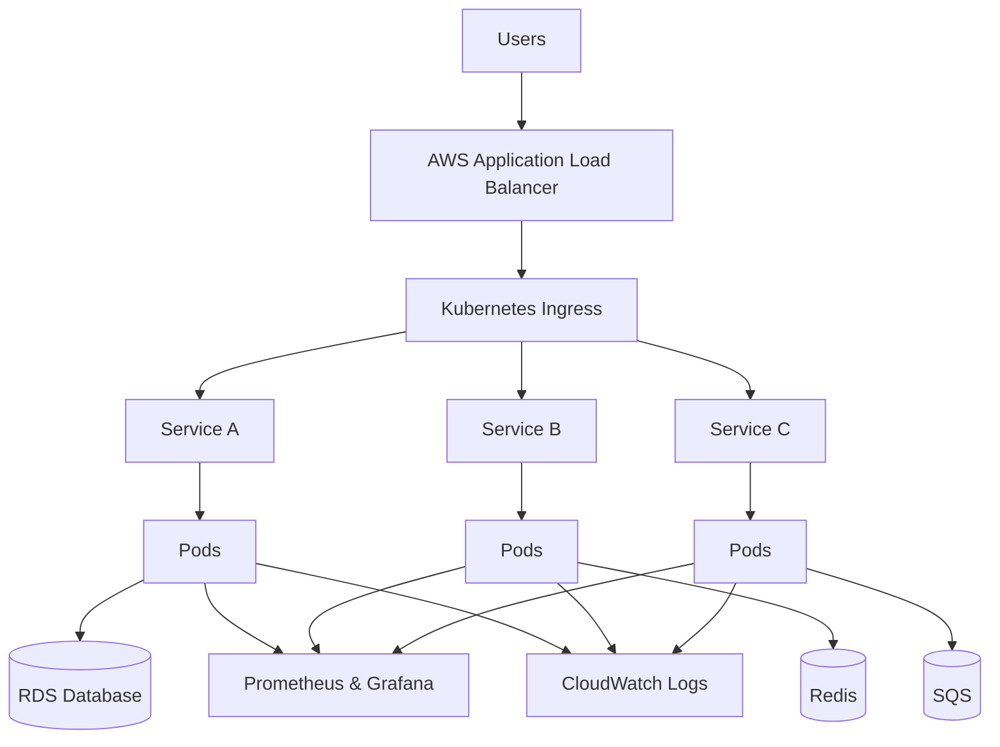
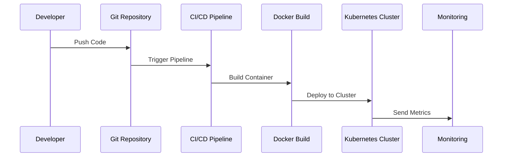
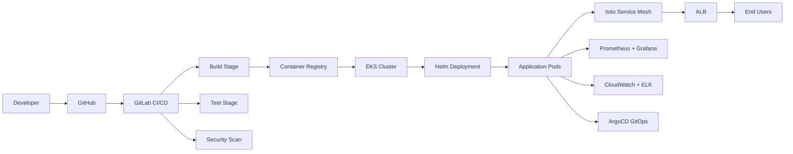
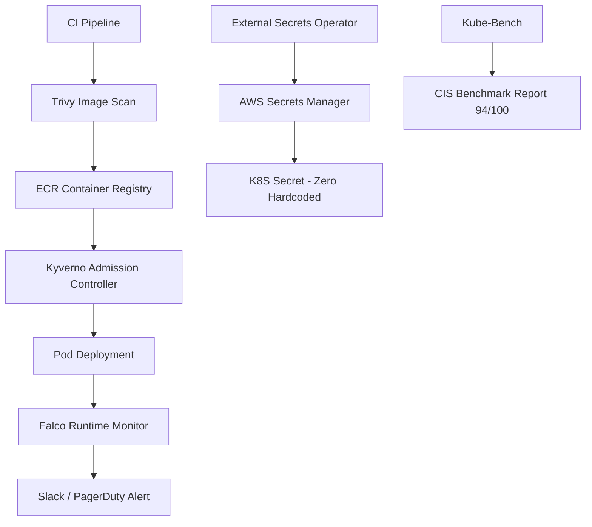

# 💫 About Me:

👋 Hi there! Greetings! I'm **Hari Krishna S** — a seasoned DevOps Engineer with a passion for orchestrating seamless software development lifecycles. In my current role as a Senior DevOps Engineer at **BRILLIO**, I lead the charge in crafting CI/CD pipelines using GITLAB and identifying innovative solutions to build and deployment challenges.

My journey is marked by a comprehensive approach to the software development process, ensuring DevOps practices seamlessly integrate into every phase. I am an automation maestro, scripting solutions in Python and Shell to expedite workflows and reduce errors, allowing teams to focus on strategic tasks.

My mastery extends to cloud architecture, having implemented solutions on AWS, Azure, and GCP. I specialize in architecting scalable and resilient cloud infrastructures that support agile development practices. As a containerization guru, I leverage Docker and Kubernetes to orchestrate applications, optimizing scalability and resource utilization.

Security is non-negotiable in today's landscape, and I take pride in being a security sentinel, implementing robust measures throughout the DevOps pipeline to ensure the highest standards of security and compliance.

My unique selling points lie in my ability to bridge the gap between development and operations teams, fostering cross-functional collaboration. I am an advocate for continuous learning, staying ahead of industry trends to ensure my skills remain at the forefront of DevOps innovation.

---

## 🌐 Socials:

[](https://linkedin.com/in/www.linkedin.com/in/hari-devops)
[](https://harikrishna.dev)

---

## 💻 Tech Stack:


---

## 📊 GitHub Stats:


---

## 🏆 GitHub Trophies


---

### ✍️ Random Dev Quote


---

## 📜 Certifications

[](https://aws.amazon.com/verification)
[](https://harikrishna.dev)

✔ **AWS Certified Solutions Architect – Professional** | Validation: `d2a80620a35b4ffb86721154af7a8361`

✔ **Red Hat Certified OpenShift Administrator (EX-280)**

---

## 🏆 Awards & Recognition

🏅 **Extra Mile Award – Brillio (November 2025)**
> Recognized for exceptional dedication in CI/CD automation and Kubernetes platform reliability.

🏅 **Brillian of the Month – Brillio (April 2024)**
> Awarded for excellence in cloud infrastructure automation and production stability.

---

## 🚀 DevOps Projects

---

### 1️⃣ ☁️ AWS CI/CD Automation Platform
> **Brillio | Senior DevOps Engineer | 2022 – Present**

[](https://github.com/haridevops05)
[](https://github.com/haridevops05)
[](https://github.com/haridevops05)
[](https://github.com/haridevops05)
[](https://github.com/haridevops05)

🔹 Built a **fully automated CI/CD pipeline** using GitLab CI/CD
🔹 Automated AWS infrastructure provisioning using **Terraform modules**
🔹 Deployed containerized microservices on **Amazon EKS**
🔹 Implemented **Blue-Green deployment strategy**
🔹 Integrated **Prometheus + CloudWatch monitoring**

📊 **Result:** ~40% faster releases | Improved uptime & stability

---

### 2️⃣ 🏥 CenKube – Kubernetes Healthcare Platform
> **Accenture | DevOps Engineer | 2019 – 2022**

[](https://github.com/haridevops05)
[](https://github.com/haridevops05)
[](https://github.com/haridevops05)
[](https://github.com/haridevops05)
[](https://github.com/haridevops05)

🔹 Migrated **monolithic healthcare application to Kubernetes microservices**
🔹 Implemented **secure DevSecOps CI/CD pipelines**
🔹 Automated infrastructure using **Terraform & Ansible**
🔹 Implemented **Datadog monitoring and alerting**
🔹 Designed **highly available AWS architecture** — SOC2 & HIPAA compliant

📊 **Result:** Significantly increased deployment frequency | More stable & observable platform

---

### 3️⃣ 🔐 K8S Runtime Security Platform
> **Open Source** | [](https://github.com/haridevops05/k8s-runtime-security-platform)

[](https://github.com/haridevops05/k8s-runtime-security-platform)
[](https://github.com/haridevops05/k8s-runtime-security-platform)
[](https://github.com/haridevops05/k8s-runtime-security-platform)
[](https://github.com/haridevops05/k8s-runtime-security-platform)
[](https://github.com/haridevops05/k8s-runtime-security-platform)

🔹 🔍 **Falco** — Runtime threat detection: crypto mining, shell spawn & privilege escalation
🔹 🛡️ **Kyverno** — Admission controller: block root containers & enforce resource limits
🔹 📋 **Kube-Bench** — CIS Kubernetes Benchmark scanning — **94/100 score**
🔹 🔑 **External Secrets Operator** — Zero hardcoded secrets via AWS Secrets Manager
🔹 🔒 **Trivy** — Container image vulnerability scanning in every pipeline

📊 **Result:** 94/100 CIS Score | Zero Critical CVEs | Zero Hardcoded Secrets | HIPAA Compliant

---

### 4️⃣ 🕸️ Istio Service Mesh Platform
> **Open Source** | [](https://github.com/haridevops05/istio-service-mesh-platform)

[](https://github.com/haridevops05/istio-service-mesh-platform)
[](https://github.com/haridevops05/istio-service-mesh-platform)
[](https://github.com/haridevops05/istio-service-mesh-platform)
[](https://github.com/haridevops05/istio-service-mesh-platform)

🔹 🔐 **mTLS** — Zero-trust encryption between ALL microservices — 100% coverage
🔹 🚀 **Canary Deployments** — 90/10 traffic splitting with VirtualServices & DestinationRules
🔹 ⚡ **Circuit Breaker** — Auto-eject unhealthy pods to prevent cascade failures
🔹 🧪 **Fault Injection** — Chaos engineering with delay and error injection
🔹 📊 **Kiali + Jaeger** — Service topology visualization & distributed tracing

📊 **Result:** 100% mTLS Coverage | Zero failed deployments to production | 15 min MTTR

---

### 5️⃣ 🔄 GitOps Platform — ArgoCD + Argo Rollouts
> **Open Source** | [](https://github.com/haridevops05/gitops-argocd-platform)

[](https://github.com/haridevops05/gitops-argocd-platform)
[](https://github.com/haridevops05/gitops-argocd-platform)
[](https://github.com/haridevops05/gitops-argocd-platform)
[](https://github.com/haridevops05/gitops-argocd-platform)

🔹 🏗️ **App of Apps Pattern** — Single sync deploys Dev, Staging & Production clusters
🔹 📈 **Argo Rollouts** — Canary with Prometheus AnalysisTemplates for auto-rollback
🔹 🌐 **Multi-Cluster Management** — Auto-sync Dev/Staging, manual approval for Production
🔹 ⚡ **Drift Detection** — Auto-remediates manual changes — zero configuration drift
🔹 🔄 **GitHub Actions Pipeline** — Build → Scan → Push ECR → Update GitOps → ArgoCD Sync

📊 **Result:** 15+ deployments/day | 3-min MTTR via auto-rollback | Zero manual deployments

---

## 💼 Experience

### 🏢 Senior DevOps Engineer – Brillio

[](https://harikrishna.dev)
[](https://harikrishna.dev)
[](https://harikrishna.dev)
[](https://harikrishna.dev)

📅 **Jun 2022 – Present**

🔹 Architected scalable AWS cloud infrastructure for microservices at scale
🔹 Built GitLab CI/CD pipelines for multi-environment deployments
🔹 Managed Kubernetes workloads on Amazon EKS with KOPS and Helm
🔹 Implemented Prometheus and CloudWatch monitoring

---

### 🏢 DevOps Engineer – Accenture

[](https://harikrishna.dev)
[](https://harikrishna.dev)
[](https://harikrishna.dev)

📅 **May 2019 – Jun 2022**

🔹 Migrated enterprise platform to Kubernetes microservices
🔹 Built DevSecOps pipelines with security scanning
🔹 Implemented monitoring using Datadog and CloudWatch

---

## 🎓 Education

🎓 **Bachelor of Computer Applications (BCA)**

[](https://harikrishna.dev)

📅 2019 | 📊 GPA: **95%**

---

## ☁️ DevOps Architecture (AWS + Kubernetes)



---

## ⚙️ Kubernetes Microservices Architecture



---

## 🚀 DevOps CI/CD Pipeline



---

## 🏗️ Enterprise DevOps Architecture



---

## 🔐 K8S Security Architecture



---

## 🧠 DevOps Expertise

```
CI/CD        → GitLab CI | Jenkins | GitHub Actions | ArgoCD
Containers   → Docker | Kubernetes (EKS, KOPS, AKS) | OpenShift | Helm
IaC          → Terraform | CloudFormation | Ansible
Security     → Falco | Kyverno | Kube-Bench | Trivy | ESO | AWS Security Hub
Service Mesh → Istio | Kiali | Jaeger | Envoy Proxy
GitOps       → ArgoCD | Argo Rollouts | Progressive Delivery
Monitoring   → Prometheus | Grafana | Datadog | CloudWatch | EFK Stack
Cloud        → AWS (SA Professional) | Azure | GCP
```

---

*🌐 Portfolio: [harikrishna.dev](https://harikrishna.dev) | 📧 s.harikrishna.1205@gmail.com | 📍 Hyderabad, India*
