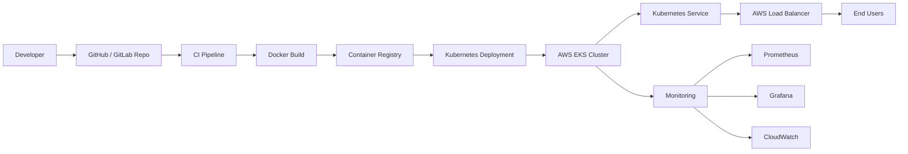
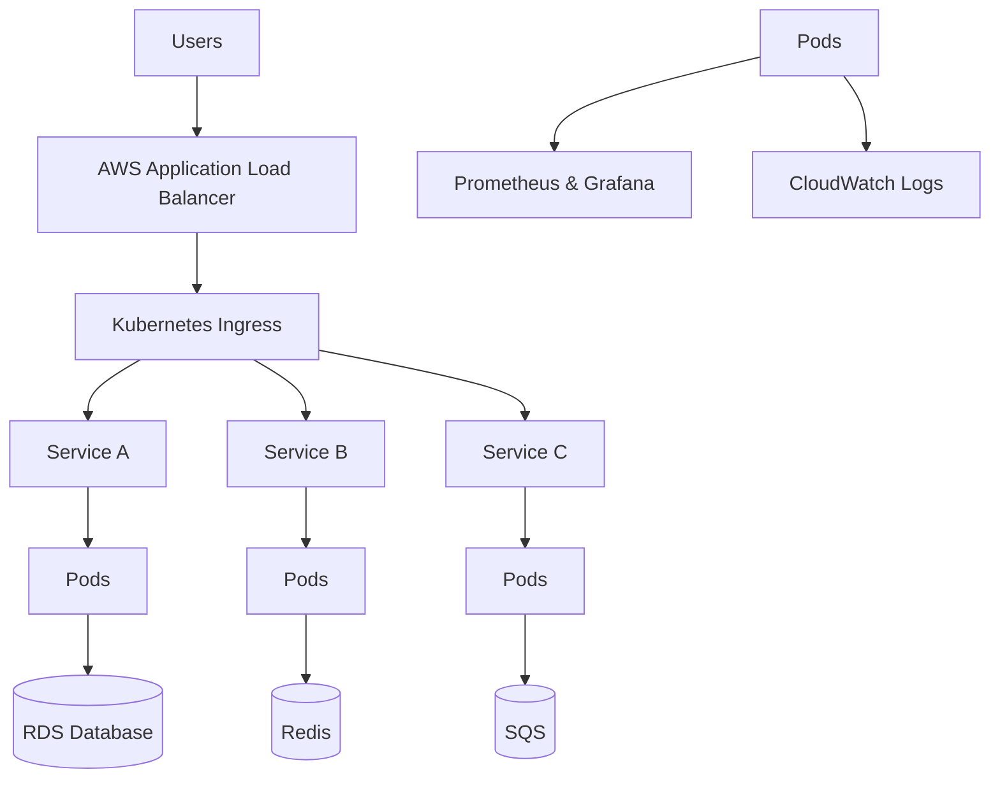
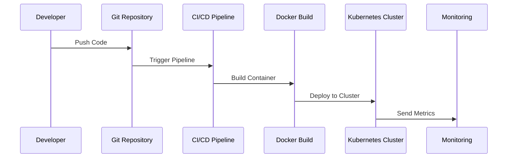
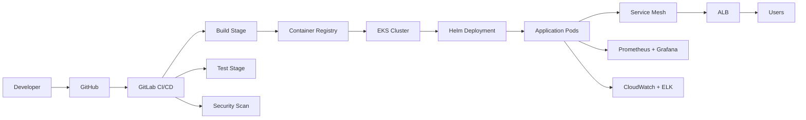

# 💫 About Me:
👋 Hi there! Greetings! I'm [S Hari Krishna], a seasoned DevOps Engineer with a passion for orchestrating seamless software development lifecycles. In my current role as a Senior DevOps Engineer at BRILLIO, I lead the charge in crafting CI/CD pipelines using GITLAB and identifying innovative solutions to build and deployment challenges.  My journey is marked by a comprehensive approach to the software development process, ensuring DevOps practices seamlessly integrate into every phase. I am an automation maestro, scripting solutions in Python and Shell to expedite workflows and reduce errors, allowing teams to focus on strategic tasks.  My mastery extends to cloud architecture, having implemented solutions on AWS, Azure, and GCP. I specialize in architecting scalable and resilient cloud infrastructures that support agile development practices. As a containerization guru, I leverage Docker and Kubernetes to orchestrate applications, optimizing scalability and resource utilization.  Security is non-negotiable in today's landscape, and I take pride in being a security sentinel, implementing robust measures throughout the DevOps pipeline to ensure the highest standards of security and compliance.  My unique selling points lie in my ability to bridge the gap between development and operations teams, fostering cross-functional collaboration. I am an advocate for continuous learning, staying ahead of industry trends to ensure my skills remain at the forefront of DevOps innovation.

## 🌐 Socials:
 

# 💻 Tech Stack:
             
# 📊 GitHub Stats:
 
 

## 🏆 GitHub Trophies

### ✍️ Random Dev Quote

<!-- Proudly created with GPRM ( https://gprm.itsvg.in ) -->

- [devopshari.com](link-to-portfolio): Explore more about my work and projects.

## 🚀 DevOps Projects

### ☁️ AWS CI/CD Automation Platform

🔹 Built a **fully automated CI/CD pipeline** using GitLab CI/CD  
🔹 Automated AWS infrastructure provisioning using **Terraform modules**  
🔹 Deployed containerized microservices on **Amazon EKS**  
🔹 Implemented **Blue-Green deployment strategy**  
🔹 Integrated **Prometheus + CloudWatch monitoring**

---

### 🏥 CenKube – Kubernetes Healthcare Platform

🔹 Migrated **monolithic healthcare application to Kubernetes microservices**  
🔹 Implemented **secure DevSecOps CI/CD pipelines**  
🔹 Automated infrastructure using **Terraform & Ansible**  
🔹 Implemented **Datadog monitoring and alerting**  
🔹 Designed **highly available AWS architecture**

## 💼 Experience

### 🏢 Senior DevOps Engineer – Brillio

📅 Jun 2022 – Present  

🔹 Architected scalable AWS cloud infrastructure  
🔹 Built GitLab CI/CD pipelines for multi-environment deployments  
🔹 Managed Kubernetes workloads on Amazon EKS  
🔹 Implemented Prometheus and CloudWatch monitoring  

---

### 🏢 DevOps Engineer – Accenture

📅 May 2019 – Jun 2022  

🔹 Migrated enterprise platform to Kubernetes microservices  
🔹 Built DevSecOps pipelines with security scanning  
🔹 Implemented monitoring using Datadog and CloudWatch  

## 🎓 Education

🎓 **Bachelor of Computer Applications (BCA)**  

📅 2019  
📊 GPA: **95%**

## 📜 Certifications

✔ AWS Certified Solutions Architect – Professional  

---

✔ Red Hat Certified OpenShift Administrator (EX-280)

## 🏆 Awards & Recognition

🏅 **Extra Mile Award – Brillio (2025)**  
Recognized for CI/CD automation and Kubernetes platform reliability.

🏅 **Brillian of the Month – Brillio (2024)**  
Awarded for excellence in cloud infrastructure automation.

## ☁️ DevOps Architecture (AWS + Kubernetes)

## ⚙️ Kubernetes Microservices Architecture

## 🚀 DevOps CI/CD Pipeline

## 🏗️ Enterprise DevOps Architecture

## 🧠 DevOps Expertise

CI/CD → GitLab CI | Jenkins | GitHub Actions  
Containers → Docker | Kubernetes | OpenShift  
IaC → Terraform | CloudFormation | Ansible  
Monitoring → Prometheus | Grafana | Datadog | CloudWatch  
Cloud → AWS | Azure | GCP
