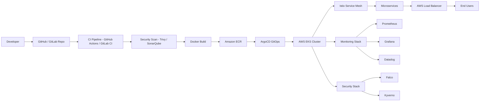

# 💫 About Me:

👋 Hi there! I'm **Hari Krishna S** — a Senior DevOps Engineer with 6+ years of experience orchestrating seamless software development lifecycles at **Brillio** and **Accenture**.

I specialize in **AWS cloud architecture**, **Kubernetes orchestration**, **DevSecOps pipelines**, and **GitOps delivery** — building secure, scalable, and production-grade platforms for enterprise workloads.

🔐 Security-first mindset | ☁️ Cloud-native expert | 🚀 Automation enthusiast

---

## 🌐 Socials:

[](https://linkedin.com/in/hari-devops)
[](https://harikrishna.dev)
[](https://github.com/haridevops05)

---

## 📜 Certifications

[](https://aws.amazon.com/verification)
[](https://harikrishna.dev)

✔ **AWS Certified Solutions Architect – Professional** | Validation: `d2a80620a35b4ffb86721154af7a8361`
✔ **Red Hat Certified OpenShift Administrator (EX-280)**

---

## 🏆 Awards & Recognition

🏅 **Extra Mile Award – Brillio (November 2025)**
> Recognized for exceptional dedication in CI/CD automation and Kubernetes platform reliability.

🏅 **Brillian of the Month – Brillio (April 2024)**
> Awarded for excellence in cloud infrastructure automation and production stability.

---

## 💻 Tech Stack:


---

## 🚀 DevOps Projects

### 1️⃣ CI/CD Automation & Scalable AWS Infrastructure
> **Brillio | Senior DevOps Engineer | 2022 – Present**


🔹 Designed and provisioned AWS infrastructure using **modular Terraform and CloudFormation** templates
🔹 Built **GitLab CI/CD and Jenkins pipelines** for automated build, test, image scanning, and deployment
🔹 Deployed containerized microservices to **Amazon EKS** using Helm charts across multiple environments
🔹 Implemented observability with **CloudWatch and Prometheus**, reducing MTTR significantly
🔹 Enabled **Blue-Green deployments** with zero downtime across production environments

📊 **Result:** ~40% faster release cycles | Improved platform stability & uptime

---

### 2️⃣ CenKube – Kubernetes Healthcare Platform
> **Accenture | DevOps Engineer | 2019 – 2022**


🔹 Migrated **monolithic healthcare application** to containerized microservices on Amazon EKS
🔹 Built **GitLab CI/CD pipelines** with rollback, approvals, and environment promotion controls
🔹 Implemented **IAM, Secrets Manager, and network segmentation** for HIPAA & SOC2 compliance
🔹 Set up **Datadog + CloudWatch dashboards** to monitor pods, services, and infrastructure health
🔹 Automated infrastructure with **Terraform & Ansible** — eliminating configuration drift

📊 **Result:** Significantly increased deployment frequency | More stable & observable platform

---

### 3️⃣ 🔐 K8S Runtime Security Platform
> **Open Source Project** | [View Repository](https://github.com/haridevops05/k8s-runtime-security-platform)


**Production-grade 4-layer Kubernetes security stack for HIPAA & SOC2 compliant workloads.**

🔹 🔍 **Falco** — Runtime threat detection with custom rules: crypto mining, shell spawn, privilege escalation
🔹 🛡️ **Kyverno** — Admission controller policies: block root containers, enforce resource limits, require labels
🔹 📋 **Kube-Bench** — Automated CIS Kubernetes Benchmark scanning — achieved **94/100 score**
🔹 🔑 **External Secrets Operator (ESO)** — Zero hardcoded secrets via AWS Secrets Manager integration
🔹 🔒 **Trivy** — Container image vulnerability scanning before every deployment

📊 **Result:** 94/100 CIS Score | Zero Critical CVEs | Zero Hardcoded Secrets | HIPAA Compliant

---

### 4️⃣ 🕸️ Istio Service Mesh Platform
> **Open Source Project** | [View Repository](https://github.com/haridevops05/istio-service-mesh-platform)


**Zero-trust service mesh with advanced traffic management, observability, and chaos engineering.**

🔹 🔐 **mTLS** — Zero-trust encryption between ALL microservices — 100% mesh coverage
🔹 🚀 **Canary Deployments** — 90/10 traffic splitting with VirtualServices and DestinationRules
🔹 ⚡ **Circuit Breaker** — Auto-eject unhealthy pods to prevent cascade failures
🔹 🧪 **Fault Injection** — Chaos engineering with delay and error injection for resilience testing
🔹 📊 **Kiali + Jaeger** — Service topology visualization and distributed tracing

📊 **Result:** 100% mTLS Coverage | Zero failed deployments reaching production

---

### 5️⃣ 🔄 GitOps Platform — ArgoCD + Argo Rollouts
> **Open Source Project** | [View Repository](https://github.com/haridevops05/gitops-argocd-platform)


**Enterprise GitOps platform with progressive delivery and automatic Prometheus-based rollback.**

🔹 🏗️ **App of Apps Pattern** — Single sync deploys all Dev, Staging, and Production clusters
🔹 📈 **Argo Rollouts** — Canary deployments with Prometheus AnalysisTemplates for auto-rollback
🔹 🌐 **Multi-Cluster Management** — Auto-sync Dev/Staging, manual approval for Production
🔹 ⚡ **Drift Detection** — Auto-remediates manual cluster changes — zero configuration drift
🔹 🔄 **GitHub Actions → GitOps** — Full CI/CD: build → scan → push ECR → update GitOps repo → ArgoCD sync

📊 **Result:** 15+ deployments/day | 3-min MTTR via auto-rollback | Zero manual deployments

---

## 💼 Experience

### 🏢 Senior DevOps Engineer – Brillio
📅 **Jun 2022 – Present** | Hyderabad, India

🔹 Architecting scalable AWS cloud infrastructure for microservices at scale
🔹 Building GitLab CI/CD pipelines for multi-environment deployments
🔹 Managing Kubernetes workloads on Amazon EKS with KOPS and Helm
🔹 Implementing Prometheus, Grafana, Datadog and CloudWatch observability

---

### 🏢 DevOps Engineer – Accenture
📅 **May 2019 – Jun 2022** | Bengaluru, India (Remote)

🔹 Migrated enterprise healthcare platform to Kubernetes microservices on EKS
🔹 Built DevSecOps pipelines with security scanning and HIPAA compliance
🔹 Implemented monitoring using Datadog, Prometheus and CloudWatch

---

## 🎓 Education

🎓 **Bachelor of Computer Applications (BCA)**
📍 KBN College, Vijayawada | 📅 2019 | 📊 GPA: **95%**

---

## 📊 GitHub Stats:


## 🏆 GitHub Trophies


---

## ☁️ DevOps Architecture



---

## 🧠 DevOps Expertise

```
CI/CD      → GitLab CI | Jenkins | GitHub Actions | ArgoCD
Containers → Docker | Kubernetes (EKS, KOPS, AKS) | OpenShift | Helm
IaC        → Terraform | CloudFormation | Ansible
Security   → Falco | Kyverno | Kube-Bench | Trivy | ESO | AWS Security Hub
Service Mesh → Istio | Kiali | Jaeger | Envoy
Monitoring → Prometheus | Grafana | Datadog | CloudWatch | EFK Stack
Cloud      → AWS (SA Professional) | Azure | GCP
GitOps     → ArgoCD | Argo Rollouts | Progressive Delivery
```

---

### ✍️ Random Dev Quote


---

*🌐 Portfolio: [harikrishna.dev](https://harikrishna.dev) | 📧 s.harikrishna.1205@gmail.com*
